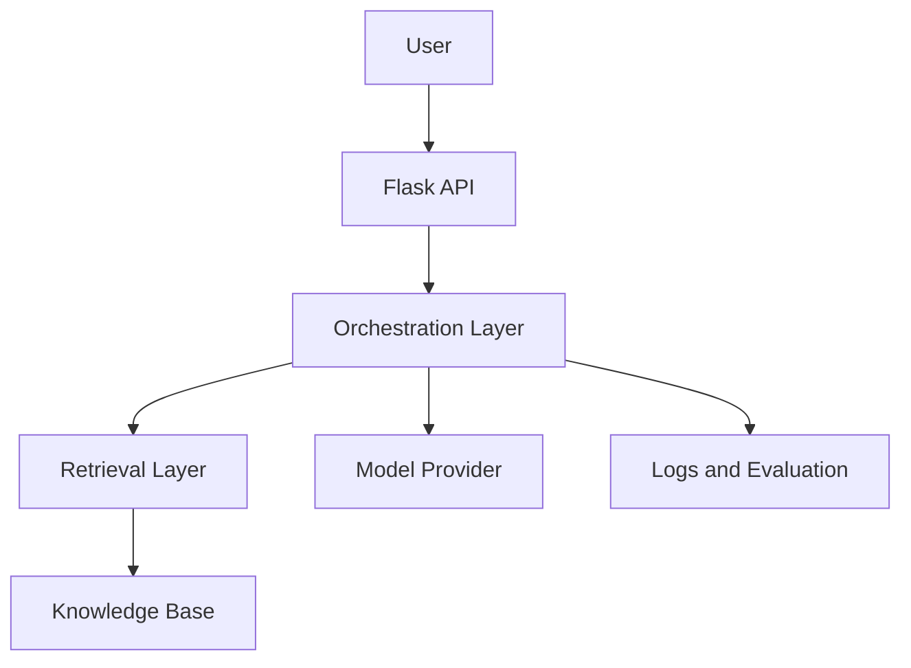

# Architecture Diagrams

High-level system maps and flow views live here.

## System View

```mermaid
flowchart TD
  U[User] --> API[Flask API]
  API --> ORCH[Orchestration Layer]
  ORCH --> RET[Retrieval Layer]
  ORCH --> LLM[Model Provider]
  RET --> KB[Knowledge Base]
  ORCH --> OBS[Logs and Evaluation]
```
