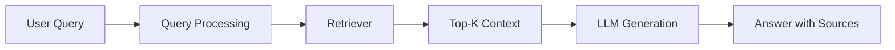

# RAG Systems

## What is RAG (Real-World Explanation)

RAG means retrieving relevant knowledge first, then generating an answer grounded in that evidence.

## When RAG Works Well / Fails

RAG works well when knowledge is large, private, or frequently updated. It fails when chunking is poor, retrieval is weak, or source quality is inconsistent.

## My RAG Architecture (Diagram Optional)

Use the pages below for implementation detail.
